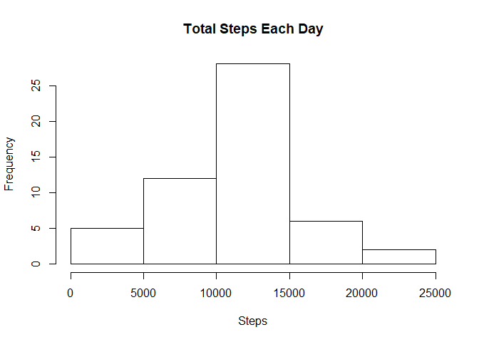
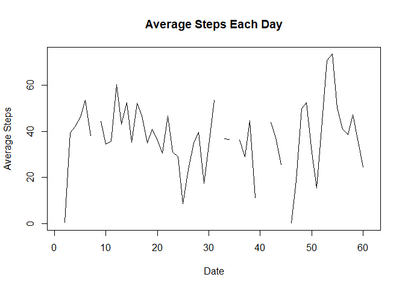
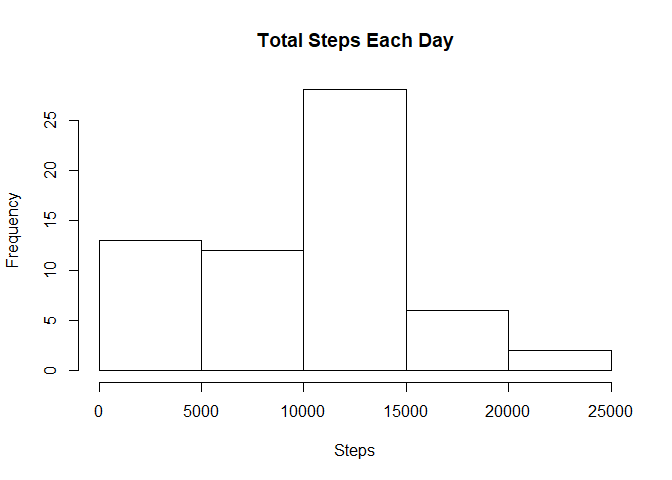
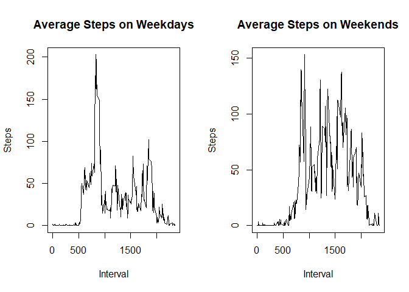

## Loading and preprocessing the data

Reading the data set. Set your own unique path.

```r
data=read.csv(file = 'E:/R Working Directory/activity.csv')
```

Checking for count of missing values.

```r
colSums(is.na(data))
```

```
##    steps     date interval 
##     2304        0        0
```

```r
dim(data)
```

```
## [1] 17568     3
```

dplyr.

```r
library(dplyr)
```

```
## 
## Attaching package: 'dplyr'
```

```
## The following objects are masked from 'package:stats':
## 
##     filter, lag
```

```
## The following objects are masked from 'package:base':
## 
##     intersect, setdiff, setequal, union
```

Grouping, summing and averaging the steps by 5 minute intervals and by day. Sleeping by night.  

```r
day=group_by(.data = tbl_df(data),date)
steps_each_day=summarise(.data = day,steps=sum(steps))
average_steps_each_day=summarise(.data = day,steps=mean(steps))

interval=group_by(.data = tbl_df(data),interval)
average_steps_each_interval=summarise(.data = interval,steps=mean(steps,na.rm = TRUE))
```

## What is mean total number of steps taken per day?

Creating this horrible, dirty histogram. Very mean, median.

```r
hist(x = steps_each_day$`steps`,xlab = 'Steps',main = 'Total Steps Each Day')
```

<!-- -->

```r
mean(x = steps_each_day$`steps`,na.rm = TRUE)
```

```
## [1] 10766.19
```

```r
median(x = steps_each_day$`steps`,na.rm = TRUE)
```

```
## [1] 10765
```

## What is the average daily activity pattern?

Plotting a time series for average steps each day. Also we print the interval for which average steps is maximum.

```r
plot(x = average_steps_each_day$steps,type = 'l',xlab = 'Date',ylab = 'Average Steps',main='Average Steps Each Day')
```

<!-- -->

```r
average_steps_each_interval[which.max(average_steps_each_interval$steps),]
```

```
## # A tibble: 1 x 2
##   interval    steps
##      <int>    <dbl>
## 1      835 206.1698
```

## Imputing missing values

We will import the data again for the purposes of imputation.

```r
data=read.csv(file = 'E:/R Working Directory/activity.csv')
dim(data)
```

```
## [1] 17568     3
```

Checking for missing values. Turns out there are missing values in the steps variables. 
We'll call table(steps) to see what kind of values exist within that variable

```r
colSums(is.na(data))
```

```
##    steps     date interval 
##     2304        0        0
```

```r
table(data$steps)[1:10]
```

```
## 
##     0     1     2     3     4     5     6     7     8     9 
## 11014     7     8     3    25    17    33    87    83    61
```

We can see that most of the observations are zero. We will turn the missing values into zero as well.

```r
data[is.na(data)]=0
colSums(is.na(data))
```

```
##    steps     date interval 
##        0        0        0
```

No more missing values!
Grouping, summing and averaging the steps by 5 minute intervals and by day. Sleeping by night.  

```r
day=group_by(.data = tbl_df(data),date)
steps_each_day=summarise(.data = day,steps=sum(steps))
average_steps_each_day=summarise(.data = day,steps=mean(steps))

interval=group_by(.data = tbl_df(data),interval)
average_steps_each_interval=summarise(.data = interval,steps=mean(steps,na.rm = TRUE))
```

Histogram of total steps each day

```r
hist(x = steps_each_day$`steps`,xlab = 'Steps',main = 'Total Steps Each Day')
```

<!-- -->

## Are there differences in activity patterns between weekdays and weekends?

Preparing data for panel plot for weekday-weekend comparison. Then we plot it.

```r
interval[is.na(interval)]=0
interval=mutate(interval,date=as.Date(date),day=weekdays(date))
weekday=filter(interval,day!='Saturday',day!='Sunday')
weekend=filter(interval,day=='Saturday'|day=='Sunday')

weekday=summarise(weekday,steps=mean(steps))
weekend=summarise(weekend,steps=mean(steps))

par(mfrow=c(1,2))
plot(x = weekday,type = 'l',xlab = 'Interval',ylab='Steps',main = 'Average Steps on Weekdays')
plot(x = weekend,type = 'l',xlab = 'Interval',ylab='Steps',main = 'Average Steps on Weekends')
```

<!-- -->

